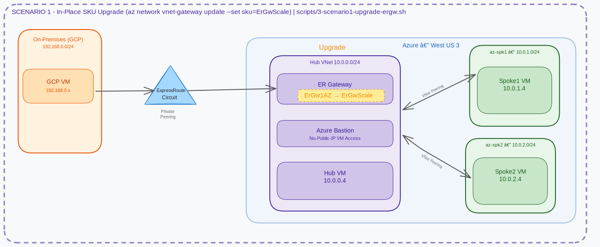
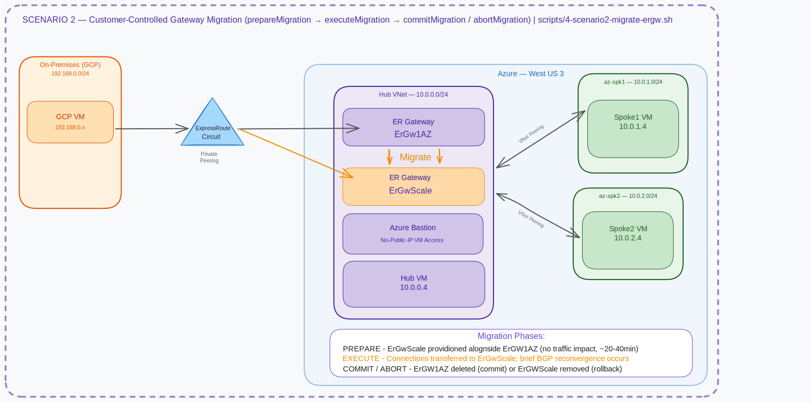

# Azure ExpressRoute Gateway Upgrade Lab: ErGwAZ → ErGwScale

[](./LICENSE)
[](./bicep/)

This lab demonstrates two methods to upgrade an existing Azure ExpressRoute Gateway from an AZ-enabled SKU (**ErGw1AZ / ErGw2AZ / ErGw3AZ**) to the **Scalable ExpressRoute Gateway (ErGwScale)** with minimal or zero downtime. GCP is used to simulate an on-premises environment connected via a Megaport partner interconnect.

---

## Two Upgrade Scenarios

| | Scenario 1 | Scenario 2 |
|---|---|---|
| **Name** | In-Place Upgrade | Gateway Migration |
| **How it works** | Azure modifies the existing gateway SKU in-place | Azure deploys a new ErGwScale alongside the old one, then migrates connections |
| **Source SKUs** | ErGw1AZ, ErGw2AZ, ErGw3AZ | Any SKU including legacy (Standard, HighPerf, UltraPerf) |
| **Script** | `3-scenario1-upgrade-ergw.sh` | `4-scenario2-migrate-ergw.sh` |
| **Duration** | ~20–45 min (single operation) | ~40–75 min (3 phases with validation window) |
| **Rollback** | Not supported after upgrade | Supported: abort after Execute, before Commit |
| **BGP disruption** | Brief flap (typically milliseconds) | Brief flap during Execute phase only |
| **Control granularity** | Single-step | Phase-by-phase (Prepare → Execute → Commit/Abort) |
| **Best for** | Standard AZ gateway upgrades with minimal steps | Controlled migrations, legacy SKU moves, or when explicit rollback is required |

### Which scenario should I use?

- **Choose Scenario 1** if your gateway is already on an AZ SKU (ErGw1AZ/2AZ/3AZ) and you want the simplest possible upgrade path with no extra complexity.
- **Choose Scenario 2** if you need a customer-controlled migration with an explicit validation window and rollback option, or if you have a legacy non-AZ SKU (Standard, HighPerf, UltraPerf).

> Both scenarios start with the **same setup scripts** (1 and 2). The path diverges at script 3 vs script 4.

---

## Why Upgrade to ErGwScale?

The **Scalable ExpressRoute Gateway** (SKU: `ErGwScale`) is the next-generation gateway designed for enterprise and large-scale hybrid connectivity. Legacy SKUs (ErGw1AZ, ErGw2AZ, ErGw3AZ) have **fixed, hard-capped throughput** and do not adapt to changing traffic demands. ErGwScale removes these ceilings and introduces elastic, pay-per-use scaling.

### Throughput: From Fixed Limits to 40 Gbps

| SKU | Max Throughput | Scale Units | Zone Redundant |
|-----|---------------|-------------|----------------|
| ErGw1AZ | ~1 Gbps | 1 (fixed) | Yes |
| ErGw2AZ | ~2 Gbps | 2 (fixed) | Yes |
| ErGw3AZ | ~10 Gbps | 10 (fixed) | Yes |
| **ErGwScale** | **up to 40 Gbps** | **1–40 (auto or manual)** | **Yes** |

> Each scale unit adds ~1 Gbps of gateway throughput. You can configure auto-scale min/max bounds or set a fixed number of units.

### Business Value Summary

| Benefit | Legacy SKUs | ErGwScale |
|---------|-------------|-----------|
| **Maximum throughput** | Up to 10 Gbps (fixed) | Up to **40 Gbps** (scalable) |
| **Active-active multi-circuit** | Gateway-limited | Full bandwidth from all circuits |
| **Cost efficiency** | Pay for fixed SKU | Pay only for scale units in use |
| **Elastic scaling** | Manual SKU change = downtime | Auto-scale with min/max bounds |
| **Zone redundancy** | Yes (AZ variants) | Yes (built-in) |
| **Upgrade path** | Disruptive SKU change | **In-place or migration, non-disruptive** |

---

## Architecture

### Scenario 1 — Lab Topology & In-Place SKU Upgrade

> 📐 [Open in Excalidraw](https://excalidraw.com/#url=https://raw.githubusercontent.com/dmauser/azure-er-scalablegw/main/diagrams/scenario1-architecture.excalidraw)



### Scenario 2 — Gateway Migration Flow (3-Phase)

> 📐 [Open in Excalidraw](https://excalidraw.com/#url=https://raw.githubusercontent.com/dmauser/azure-er-scalablegw/main/diagrams/scenario2-architecture.excalidraw)



---

### Scenario 1 Flow — In-Place Upgrade

```
┌──────────────┐                    ┌──────────────┐
│   ErGw1AZ    │  az vnet-gateway   │  ErGwScale   │
│  (existing)  │ ────── update ──►  │  (same GW)   │
│              │   SKU change only  │  Auto-scale  │
└──────────────┘                    └──────────────┘
      Script 3                            ↑
   (single step)                    ER connections stay attached
```

### Scenario 2 Flow — Gateway Migration

```
  Phase 1 PREPARE      Phase 2 EXECUTE       Phase 3: COMMIT or ABORT
  ───────────────      ───────────────       ────────────────────────
  ┌─────────────┐      ┌─────────────┐
  │ ErGw1AZ     │      │ ErGw1AZ     │  OK ──► ┌──────────────────┐
  │ (original)  │      │ (fading...) │         │  ③ COMMIT  ✅    │
  │ Active ✓    │ ──►  │             │         │  ErGwScale: sole │
  │             │      │ ErGwScale   │         │  Old gw: deleted │
  │ ErGwScale   │      │ (active) ✓  │         └──────────────────┘
  │ (new, prvs) │      └─────────────┘
  └─────────────┘      connections          ↩ ──► ┌──────────────────┐
  No traffic impact    transferred                 │  ③ ABORT   ↩    │
  ~20-40 min           (brief BGP flap)            │  ErGw1AZ: back  │
                        ~5-15 min                  │  New gw: gone   │
                                                   └──────────────────┘
```

---

## Repository Structure

```
azure-er-scalablegw/
├── README.md
├── LICENSE
├── bicep/
│   ├── main.bicep              # Orchestration: VNets, VMs, Bastion, KV, ER GW
│   ├── main.bicepparam         # Default parameters
│   └── modules/
│       ├── hub-vnet.bicep      # Hub VNet with all subnets
│       ├── spoke-vnet.bicep    # Spoke VNet (reusable)
│       ├── vnet-peering.bicep  # VNet peering with gateway transit
│       ├── keyvault.bicep      # Key Vault + auto-generated admin password
│       ├── bastion.bicep       # Azure Bastion (Basic SKU)
│       ├── vm.bicep            # Ubuntu 22.04 VM, no public IP, boot diagnostics
│       └── er-gateway.bicep    # ExpressRoute Gateway (upgradeable SKU)
├── scripts/
│   ├── lib/
│   │   └── validate.sh             # Shared pre-flight validation functions
│   ├── 1-deploy-azure.sh           # [COMMON] Deploy Azure infra + ER circuit + connection
│   ├── 2-deploy-onprem-gcp.sh      # [COMMON] GCP on-premises simulation
│   ├── 3-scenario1-upgrade-ergw.sh # [SCENARIO 1] In-place upgrade: ErGwAZ → ErGwScale
│   ├── 4-scenario2-migrate-ergw.sh # [SCENARIO 2] Gateway migration: ErGwAZ → ErGwScale
│   ├── 5-test-connectivity.sh      # [COMMON] Validate connectivity + BGP routes
│   ├── 6-monitor-downtime.sh       # [COMMON] Continuous monitoring during upgrade
│   ├── 7-cleanup-azure.sh          # [COMMON] Delete all Azure resources
│   └── 8-cleanup-gcp.sh            # [COMMON] Delete all GCP resources
└── diagrams/
    ├── architecture.excalidraw            # Combined source diagram (both scenarios)
    ├── scenario1-architecture.excalidraw  # Scenario 1: lab topology + in-place upgrade
    ├── scenario1-architecture.svg         # Scenario 1 rendered diagram (GitHub-renderable)
    ├── scenario2-architecture.excalidraw  # Scenario 2: 3-phase migration flow
    └── scenario2-architecture.svg         # Scenario 2 rendered diagram (GitHub-renderable)
```

---

## Lab Components

| Component | Details |
|-----------|---------|
| **Hub VNet** | 10.0.0.0/24 — ER Gateway, Bastion |
| **Spoke1 VNet** | 10.0.1.0/24 — Workload subnet |
| **Spoke2 VNet** | 10.0.2.0/24 — Workload subnet |
| **VMs** | Ubuntu 22.04 · No Public IP · Serial Console + Bastion access |
| **Azure Bastion** | Basic SKU — browser-based SSH to all VMs |
| **Key Vault** | Auto-generated strong password stored as secret |
| **ER Gateway** | Starts as **ErGw1AZ** · upgraded to **ErGwScale** via scenario of choice |
| **ER Circuit** | Provider: Megaport · Location: Dallas · BW: 50 Mbps |
| **On-Prem (GCP)** | GCP VPC + VM via Megaport Partner Interconnect |

---

## Prerequisites

| Requirement | Notes |
|-------------|-------|
| Azure CLI ≥ 2.55 | `az --version` |
| Bicep CLI ≥ 0.22 | `az bicep version` or `bicep --version` |
| Azure Subscription | Owner or Contributor + Key Vault permissions |
| GCP Account | For on-premises simulation (script 2 only) |
| Megaport Account | For the partner interconnect |
| Python 3 | Required for JSON parsing in deploy scripts |

### Recommended Environment

> **Best experience:** Run the Azure scripts from a **Linux environment** — native Linux, WSL 2, or Azure Cloud Shell. Windows CMD / PowerShell is not supported.

#### Option A — Linux VM or WSL 2 (Recommended)

```bash
# Install Azure CLI (first time)
curl -sL https://aka.ms/InstallAzureCLIDeb | sudo bash

# Update Azure CLI to the latest version
az upgrade

# Install / update the Bicep CLI
az bicep install
az bicep upgrade

# Verify versions
az --version
az bicep version
```

#### Option B — Azure Cloud Shell

Open [shell.azure.com](https://shell.azure.com) — Azure CLI and Bicep are always up to date. The deploy script detects Cloud Shell and starts a keepalive.

---

## Step-by-Step Lab Guide

### Phase 0 — Clone the Repository

```bash
git clone https://github.com/dmauser/azure-er-scalablegw.git
cd azure-er-scalablegw
```

---

### Phase 1 — Deploy Azure Infrastructure (common to both scenarios)

```bash
bash scripts/1-deploy-azure.sh
```

The script runs pre-flight checks (CLI version, auth), then:
- Generates a strong admin password and stores it in Azure Key Vault
- Deploys Hub + Spokes + VMs (no public IPs) + Bastion + ER Gateway (ErGw1AZ)
- Creates the ExpressRoute Circuit
- Displays the **service key** for provisioning via Megaport
- Waits for provider provisioning, then creates the ER connection

---

### Phase 2 — Provision On-Premises (GCP, common to both scenarios)

```bash
# Run from GCP Cloud Shell or a local terminal with gcloud configured
bash scripts/2-deploy-onprem-gcp.sh
```

This creates a GCP VPC + VM + Cloud Router + Partner Interconnect attachment and outputs the **pairing key** for Megaport.

> **Manual step:** Use the Megaport portal to link the Azure ER circuit (service key) and GCP Interconnect (pairing key).

---

### Phase 3 — Test Baseline Connectivity

```bash
bash scripts/5-test-connectivity.sh
```

Validates BGP adjacency, learned routes, effective routes on VM NICs, and ICMP from spoke VMs to the GCP on-prem VM. Run this **before and after** the upgrade/migration to compare.

---

### Phase 4A — Scenario 1: In-Place Upgrade

> Recommended for AZ gateways when you want the simplest upgrade path.

**Terminal 1 — Start monitoring (recommended):**
```bash
bash scripts/6-monitor-downtime.sh
```

**Terminal 2 — Run the in-place upgrade:**
```bash
bash scripts/3-scenario1-upgrade-ergw.sh
```

What happens:
1. Pre-flight validation: SKU eligibility, subnet size, gateway state, connection health
2. Baseline snapshot captured (routes, connections, SKU)
3. `az network vnet-gateway update` submits the SKU change to `ErGwScale`
4. Progress polling every 30 seconds until `Succeeded`
5. Post-upgrade BGP validation

---

### Phase 4B — Scenario 2: Gateway Migration

> Recommended when you need explicit rollback control or are on a legacy non-AZ SKU.

**Terminal 1 — Start monitoring (recommended):**
```bash
bash scripts/6-monitor-downtime.sh
```

**Terminal 2 — Run the migration:**
```bash
bash scripts/4-scenario2-migrate-ergw.sh
```

What happens:
| Phase | Action | Duration | Impact |
|-------|--------|----------|--------|
| **1. Prepare** | Azure deploys a new ErGwScale gateway alongside the existing one | ~20–40 min | Zero — existing gateway and connections untouched |
| **2. Execute** | ER connections transferred to the new gateway | ~5–15 min | Brief BGP flap (milliseconds) |
| **3. Commit** | Old gateway deleted, migration finalised | ~5 min | None |
| *(alt) Abort* | Rollback to old gateway | ~5–10 min | Brief BGP flap |

The script pauses after Execute to let you run `5-test-connectivity.sh` before committing.

---

### Phase 5 — Post-Upgrade Validation

```bash
bash scripts/5-test-connectivity.sh
```

Confirms:
- Gateway SKU is now `ErGwScale`
- All BGP sessions re-established
- All spoke-to-on-prem routes present
- Connectivity fully restored

---

### Phase 6 — Cleanup

```bash
# Azure resources
bash scripts/7-cleanup-azure.sh

# GCP resources
bash scripts/8-cleanup-gcp.sh
```

---

## VM Access Methods

### Azure Bastion (Recommended)

1. Open [Azure Portal](https://portal.azure.com)
2. Navigate to the VM → **Connect** → **Bastion**
3. Use credentials retrieved from Key Vault (see below)

### Retrieve VM Credentials

```bash
rg=lab-er-scale
kvName=$(az keyvault list -g $rg --query '[0].name' -o tsv)

az keyvault secret show --vault-name $kvName --name admin-username --query value -o tsv
az keyvault secret show --vault-name $kvName --name admin-password --query value -o tsv
```

### Azure Serial Console

Available in the Azure Portal under VM → **Help** → **Serial Console**. No network connectivity required.

---

## IP Addressing Reference

| Network | CIDR | Usage |
|---------|------|-------|
| Hub VNet | 10.0.0.0/24 | Hub network |
| subnet1 | 10.0.0.0/27 | Hub VMs |
| GatewaySubnet | 10.0.0.64/26 | ExpressRoute Gateway (**min /26 for ErGwScale**) |
| AzureBastionSubnet | 10.0.0.192/26 | Azure Bastion |
| Spoke1 VNet | 10.0.1.0/24 | Spoke 1 |
| Spoke1/subnet1 | 10.0.1.0/27 | Spoke 1 VMs |
| Spoke2 VNet | 10.0.2.0/24 | Spoke 2 |
| Spoke2/subnet1 | 10.0.2.0/27 | Spoke 2 VMs |
| On-Premises (GCP) | 192.168.0.0/24 | Simulated on-prem |

---

## Shared Validation Library

All scripts source `scripts/lib/validate.sh`, which provides reusable pre-flight checks:

| Function | What it checks |
|----------|----------------|
| `validate_tools` | Required binaries (az, python3, jq) |
| `validate_azure_cli_version` | Azure CLI ≥ specified version |
| `validate_bicep_version` | Bicep CLI ≥ specified version |
| `validate_azure_auth` | Active `az login` session; exports subscription vars |
| `validate_resource_group` | Resource group exists |
| `validate_gateway_exists` | Gateway resource found |
| `validate_gateway_state` | provisioningState == Succeeded |
| `validate_gateway_sku_for_inplace_upgrade` | SKU is ErGw1AZ/2AZ/3AZ (Scenario 1) |
| `validate_gateway_sku_for_migration` | SKU is any non-ErGwScale (Scenario 2) |
| `validate_gateway_subnet_size` | GatewaySubnet is /26 or larger |
| `validate_er_circuit_state` | Circuit is Enabled + provider Provisioned |
| `validate_er_connections` | Lists ER connections and their states |
| `validate_no_active_migration` | No migration already in progress |

---

## Upgrade/Migration Considerations

| Scenario | Disruptive? | Notes |
|----------|-------------|-------|
| ErGw1AZ / 2AZ / 3AZ → **ErGwScale** (in-place) | **No** | Script 3. In-place live migration. |
| ErGw1AZ / 2AZ / 3AZ → **ErGwScale** (migration) | **Near-zero** | Script 4. 3-phase with rollback option. |
| **ErGwScale** → lower AZ SKU (downgrade) | **Yes** | Not supported in-place; gateway must be deleted and recreated. |
| Non-AZ SKU (Standard / HighPerf / UltraPerf) → ErGwScale | **Migration required** | Use Script 4 (Scenario 2) only. |

> **GatewaySubnet size — /26 required:** ErGwScale needs the `GatewaySubnet` to be at least **/26**. A /27 blocks the upgrade. If your subnet is /27, resize it first.

---

## References

- 📄 [Scalable ExpressRoute Gateway (ErGwScale) overview](https://learn.microsoft.com/azure/expressroute/expressroute-about-virtual-network-gateways#scalable-gateway)
- 📄 [Upgrade an ExpressRoute Gateway to ErGwScale](https://learn.microsoft.com/azure/expressroute/expressroute-howto-upgrade-expressroute-gateway)
- 📄 [Migrate an ExpressRoute virtual network gateway](https://learn.microsoft.com/azure/expressroute/expressroute-howto-gateway-migration-portal)
- 📄 [Azure Bastion — Connect to VM](https://learn.microsoft.com/azure/bastion/bastion-connect-vm-ssh-linux)
- 📄 [Megaport Azure ExpressRoute](https://docs.megaport.com/cloud/microsoft-azure/azure-expressroute/)
- 📄 [GCP Partner Interconnect](https://cloud.google.com/network-connectivity/docs/interconnect/concepts/partner-overview)

---

## Contributing

Contributions are welcome! Please open an issue or pull request. For major changes, open an issue first to discuss.

## License

This project is licensed under the MIT License — see the [LICENSE](./LICENSE) file for details.

