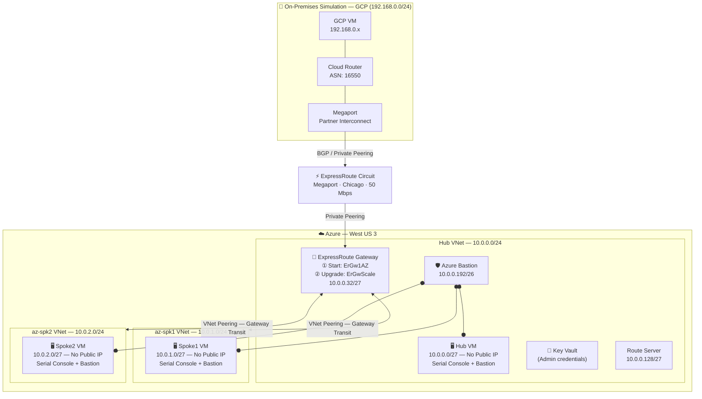

# Azure ExpressRoute Gateway Upgrade Lab: ErGw1AZ → ErGwScale

[](./LICENSE)
[](./bicep/)

This lab demonstrates how to upgrade an existing Azure ExpressRoute Gateway from **ErGw1AZ** to the **Scalable ExpressRoute Gateway (ErGwScale)** with minimal or zero downtime. GCP is used to simulate an on-premises environment connected via a Megaport partner interconnect.

## Architecture



### Upgrade Flow

```
┌──────────────┐         ┌──────────────┐
│   ErGw1AZ    │──────►  │  ErGwScale   │
│  (Standard)  │ upgrade │  (Scalable)  │
│  ~1 Gbps     │         │  Auto-scale  │
└──────────────┘         └──────────────┘
   Script 1                 Script 3
```

## Repository Structure

```
azure-er-scalablegw/
├── README.md
├── LICENSE
├── .gitignore
├── bicep/
│   ├── main.bicep              # Orchestration: VNets, VMs, Bastion, KV, ER GW
│   ├── main.bicepparam         # Default parameters
│   └── modules/
│       ├── hub-vnet.bicep      # Hub VNet with all subnets
│       ├── spoke-vnet.bicep    # Spoke VNet (reusable)
│       ├── vnet-peering.bicep  # VNet peering with gateway transit
│       ├── keyvault.bicep      # Key Vault + auto-generated admin password
│       ├── bastion.bicep       # Azure Bastion (Basic SKU)
│       ├── vm.bicep            # Ubuntu 22.04 VM, no public IP, boot diagnostics
│       └── er-gateway.bicep    # ExpressRoute Gateway (upgradeable SKU)
└── scripts/
    ├── 1-deploy-azure.azcli    # Deploy Azure infra + ER circuit + connection
    ├── 2-deploy-onprem-gcp.azcli  # GCP on-premises simulation
    ├── 3-upgrade-ergw.azcli    # Upgrade ER GW: ErGw1AZ → ErGwScale
    ├── 4-test-connectivity.sh  # Validate connectivity and routing
    └── 5-monitor-downtime.sh   # Continuous monitoring during upgrade
```

## Lab Components

| Component | Details |
|-----------|---------|
| **Hub VNet** | 10.0.0.0/24 — ER Gateway, Bastion, Route Server |
| **Spoke1 VNet** | 10.0.1.0/24 — Workload subnet |
| **Spoke2 VNet** | 10.0.2.0/24 — Workload subnet |
| **VMs** | Ubuntu 22.04 · No Public IP · Serial Console + Bastion access |
| **Azure Bastion** | Basic SKU — browser-based SSH to all VMs |
| **Key Vault** | Auto-generated strong password stored as secret |
| **ER Gateway** | Starts as **ErGw1AZ** · upgraded to **ErGwScale** |
| **ER Circuit** | Provider: Megaport · Location: Chicago · BW: 50 Mbps |
| **On-Prem (GCP)** | GCP VPC + VM via Megaport Partner Interconnect |

## Prerequisites

| Requirement | Notes |
|-------------|-------|
| Azure CLI ≥ 2.55 | `az --version` |
| Bicep CLI ≥ 0.22 | `az bicep version` or `bicep --version` |
| Azure Subscription | With Owner or Contributor + Key Vault permissions |
| GCP Account | For on-premises simulation |
| Megaport Account | For the partner interconnect between Azure ER and GCP Interconnect |
| Python 3 | For password generation in deploy script |

## Step-by-Step Lab Guide

### Phase 1 — Deploy Azure Infrastructure

```bash
# 1. Clone the repository
git clone https://github.com/dmauser/azure-er-scalablegw.git
cd azure-er-scalablegw

# 2. Review and edit parameters (optional)
# Edit bicep/main.bicepparam or override via CLI flags

# 3. Run the Azure deployment script
bash scripts/1-deploy-azure.azcli
```

The script will:
- Generate a cryptographically strong admin password
- Store it securely in Azure Key Vault
- Deploy Hub + Spokes + VMs (no public IPs) + Bastion + ER Gateway (ErGw1AZ)
- Create the ExpressRoute Circuit (Megaport / Chicago)
- Display the **service key** for provisioning via Megaport

### Phase 2 — Provision On-Premises (GCP)

```bash
# In a GCP Cloud Shell or local terminal with gcloud configured
bash scripts/2-deploy-onprem-gcp.azcli
```

This script will:
- Create a GCP VPC and subnet (192.168.0.0/24)
- Deploy a GCP VM for on-prem simulation
- Create a Cloud Router and Partner Interconnect attachment
- Display the **pairing key** to use in Megaport

> **Manual step:** Use the Megaport portal to connect the Azure ER circuit (service key) ↔ GCP Interconnect (pairing key).

### Phase 3 — Connect ExpressRoute Circuit

Once Megaport has provisioned both sides (ProviderProvisioningState = `Provisioned`):

```bash
# Script 1 (continued) will automatically detect provisioning and create the connection
# Or run manually:
bash scripts/1-deploy-azure.azcli  # Picks up from the wait loop
```

### Phase 4 — Test Baseline Connectivity

```bash
bash scripts/4-test-connectivity.sh
```

This validates:
- BGP adjacency on the ER gateway
- Learned routes from on-prem
- ICMP and traceroute from spoke VMs → GCP VM
- Effective routes on VM NICs

### Phase 5 — Monitor and Upgrade the ER Gateway

> Run the monitoring script **before** starting the upgrade to capture any micro-outage.

**Terminal 1 — Start monitoring:**
```bash
bash scripts/5-monitor-downtime.sh
```

**Terminal 2 — Upgrade the gateway:**
```bash
bash scripts/3-upgrade-ergw.azcli
```

The upgrade changes the gateway SKU from **ErGw1AZ** → **ErGwScale**. The process:
1. Azure performs an in-place upgrade (live migration)
2. Existing connections remain attached
3. BGP sessions may briefly flap (typically < 1 second)
4. The new ErGwScale gateway auto-scales based on traffic demand

### Phase 6 — Post-Upgrade Validation

```bash
bash scripts/4-test-connectivity.sh
```

Confirming:
- Gateway SKU is now `ErGwScale`
- All BGP sessions are re-established
- All spoke-to-on-prem routes are still present
- Connectivity is fully restored

## Retrieving VM Credentials

The admin password is auto-generated and stored in Key Vault:

```bash
rg=lab-er-scale
kvName=$(az keyvault list -g $rg --query '[0].name' -o tsv)

# Retrieve password
az keyvault secret show --vault-name $kvName --name admin-password --query value -o tsv

# Retrieve username
az keyvault secret show --vault-name $kvName --name admin-username --query value -o tsv
```

## VM Access Methods

### Azure Bastion (Recommended)

1. Open the [Azure Portal](https://portal.azure.com)
2. Navigate to the VM → **Connect** → **Bastion**
3. Enter the credentials retrieved from Key Vault

### Azure Serial Console

1. Open the [Azure Portal](https://portal.azure.com)
2. Navigate to the VM → **Help** → **Serial Console**
3. No network connectivity required — works even if Bastion is unavailable

## IP Addressing Reference

| Network | CIDR | Usage |
|---------|------|-------|
| Hub VNet | 10.0.0.0/24 | Hub network |
| subnet1 | 10.0.0.0/27 | Hub VMs |
| GatewaySubnet | 10.0.0.32/27 | ExpressRoute Gateway |
| AzureFirewallSubnet | 10.0.0.64/26 | Reserved (Azure Firewall) |
| RouteServerSubnet | 10.0.0.128/27 | Azure Route Server |
| AzureBastionSubnet | 10.0.0.192/26 | Azure Bastion |
| Spoke1 VNet | 10.0.1.0/24 | Spoke 1 |
| Spoke1/subnet1 | 10.0.1.0/27 | Spoke 1 VMs |
| Spoke2 VNet | 10.0.2.0/24 | Spoke 2 |
| Spoke2/subnet1 | 10.0.2.0/27 | Spoke 2 VMs |
| On-Premises (GCP) | 192.168.0.0/24 | Simulated on-prem |

## ExpressRoute Gateway SKU Comparison

| SKU | Max Throughput | Zone Redundant | Scalable |
|-----|---------------|----------------|---------|
| ErGw1AZ | 1 Gbps | ✅ | ❌ |
| ErGw2AZ | 2 Gbps | ✅ | ❌ |
| ErGw3AZ | 10 Gbps | ✅ | ❌ |
| **ErGwScale** | **Auto-scale** | ✅ | ✅ |

## Cleanup

```bash
# Azure resources
rg=lab-er-scale
az group delete --name $rg --yes --no-wait

# GCP resources
bash scripts/2-deploy-onprem-gcp.azcli  # Contains cleanup section at the bottom
```

> **Note:** Key Vault has soft-delete enabled (7-day retention). To permanently purge after deletion:
> ```bash
> az keyvault purge --name <kv-name> --location westus3
> ```

## References

- [Azure ExpressRoute Gateway Scalable SKU](https://learn.microsoft.com/azure/expressroute/expressroute-about-virtual-network-gateways#scalable-gateway)
- [Upgrade an ExpressRoute Gateway](https://learn.microsoft.com/azure/expressroute/expressroute-howto-upgrade-expressroute-gateway)
- [Azure Bastion — Connect to VM](https://learn.microsoft.com/azure/bastion/bastion-connect-vm-ssh-linux)
- [Azure Serial Console](https://learn.microsoft.com/troubleshoot/azure/virtual-machines/serial-console-linux)
- [Megaport Azure ExpressRoute](https://docs.megaport.com/cloud/microsoft-azure/azure-expressroute/)
- [GCP Partner Interconnect](https://cloud.google.com/network-connectivity/docs/interconnect/concepts/partner-overview)

## Contributing

Contributions are welcome! Please open an issue or pull request. For major changes, open an issue first to discuss the proposed change.

## License

This project is licensed under the MIT License — see the [LICENSE](./LICENSE) file for details.
